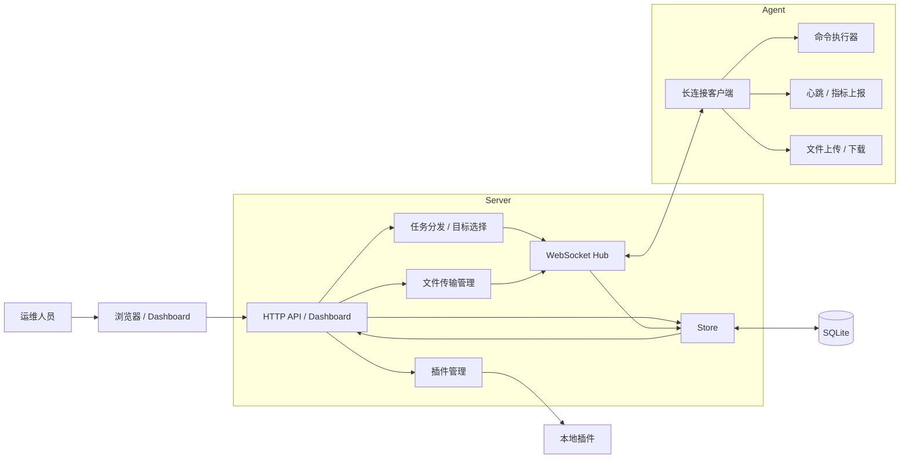

# CleanC2

轻量服务器批量管理系统。面向合法运维场景。

## 能力

- Agent 主动连接 Server
- 心跳与在线状态管理
- 单机 / 批量命令下发
- 按 `agent_ids`、`group_ids`、`tags` 选目标
- 分组模型：`groups` + `group_members`
- 任务取消
- SQLite 持久化
- 离线任务重连补发
- 文件上传 / 下载
- 文件传输 SHA256 校验
- 文件传输审计
- Agent 基础监控上报
- 本地插件钩子
- 内置 Web Dashboard
- TLS 1.3 / mTLS 参数入口

## 架构



- 运维人员通过 Web Dashboard 或 API 操作 Server。
- Server 负责鉴权、Agent 长连接管理、任务分发、文件传输、指标聚合和插件触发。
- Agent 主动连回 Server，执行命令，回传结果，并周期上报心跳和基础监控。
- SQLite 持久化 Agent、任务、分组、指标和传输审计，支持离线任务补发。

## 构建和运行

先构建：

```bash
mkdir -p ./bin
go build -o ./bin/server ./cmd/server
go build -o ./bin/agent ./cmd/agent
```

Server:

```bash
./bin/server -config ./config.yaml
```

命令行参数会覆盖 `config.yaml`。

Agent:

```bash
./bin/agent -server ws://127.0.0.1:8080/ws/agent -token cleanc2-dev-token
```

## Web

- Server 侧操作走 Web Dashboard：`/dashboard`
- API 和 Dashboard 都需要 token
- 生成 token：

```bash
openssl rand -hex 32
```

## API

- `GET /healthz`
- `GET /`
- `GET /dashboard`
- `GET /api/v1/agents`
- `GET /api/v1/agents/:id/metrics`
- `GET /api/v1/metrics/overview`
- `GET /api/v1/groups`
- `GET /api/v1/groups/:id`
- `POST /api/v1/groups`
- `POST /api/v1/tasks`
- `POST /api/v1/tasks/batch`
- `GET /api/v1/tasks/:id`
- `POST /api/v1/tasks/:id/cancel`
- `POST /api/v1/files/upload`
- `POST /api/v1/files/download`
- `GET /api/v1/transfers/:id`
- `GET /api/v1/plugins`
- `GET /ws/agent`

## 参数

Server:

- `-config`
- `-listen`
- `-token`
- `-api-token`
- `-db`
- `-plugins`
- `-tls-cert`
- `-tls-key`
- `-client-ca`

Agent:

- `-server`
- `-token`
- `-agent-id`
- `-tags`
- `-heartbeat`
- `-ca-cert`
- `-client-cert`
- `-client-key`

## 插件

`server` 会加载 `-plugins` 目录下的可执行文件。

hook:

- `agent_connected`
- `task_result`
- `transfer_done`
- `metrics_report`

事件 JSON 从 stdin 传入。样例见 `plugins/README.md` 和 `plugins/example-plugin.sh.sample`。

## 限制

- 只支持 Shell 命令执行
- 监控还是基础指标
- 插件只支持本地可执行文件钩子
