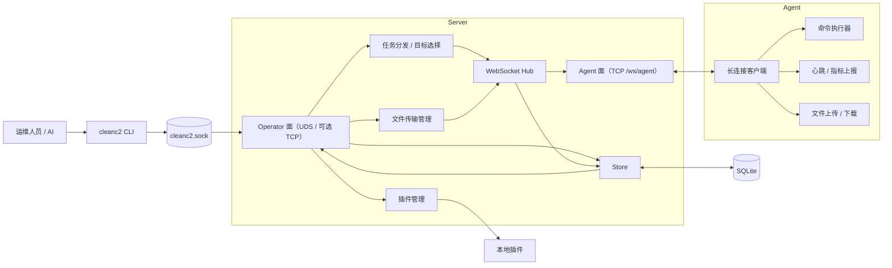

# CleanC2

轻量服务器批量管理系统。面向合法运维场景。

## 能力

- Agent 主动连接 Server
- 线协议：Protobuf 二进制帧（A1），JSON 旧帧按 hello 协商共存
- 心跳与在线状态管理
- 单机 / 批量命令下发
- 按 `agent_ids`、`group_ids`、`tags` 选目标
- 分组模型：`groups` + `group_members`
- 任务取消
- 任务超时回收（服务端兜底标记 `timeout` / `canceled`）
- 命令执行进程组隔离（取消/超时终止整棵进程树）
- SQLite 持久化
- 离线任务重连补发
- 文件上传 / 下载
- 文件传输断点续传（失败后保留 `.part` 临时文件，重试自动续传）
- 传输超时回收（进行中的传输 10 分钟无进展自动标记失败，保留 `.part`）
- 文件传输分块完整性校验（按 `Seq` 重排、缺包/重复检测）
- 文件传输 SHA256 校验（二进制帧下 chunk 不再 base64，省 33% 膨胀）
- 文件传输审计
- Agent 基础监控上报 + 指标历史（每 Agent 保留最近 1000 条）
- 本地插件钩子
- 双监听面：Agent 面（TCP `/ws/agent`）+ Operator 面（默认 Unix socket，CLI/API 专用，免 token）
- TLS 1.3 / mTLS 参数入口
- WebSocket 握手拒绝一切带 Origin 的请求（无浏览器端）
- 恒定时间 Token 比较（Operator 面 TCP 逃生门）

## 架构


```mermaid
flowchart LR
    operator["运维人员 / AI"]
    cli["cleanc2 CLI"]

    subgraph server["Server"]
        api["Operator 面（UDS / 可选 TCP）"]
        agentplane["Agent 面（TCP /ws/agent）"]
        hub["WebSocket Hub"]
        dispatch["任务分发 / 目标选择"]
        transfer["文件传输管理"]
        plugins["插件管理"]
        store["Store"]
    end

    subgraph agent_side["Agent"]
        conn["长连接客户端"]
        exec["命令执行器"]
        metrics["心跳 / 指标上报"]
        fileio["文件上传 / 下载"]
    end

    sock[("cleanc2.sock")]
    db[("SQLite")]
    hook["本地插件"]

    operator --> cli
    cli --> sock
    sock --> api
    agentplane <--> conn
    api --> dispatch
    api --> transfer
    api --> store
    api --> plugins
    dispatch --> hub
    transfer --> hub
    hub --> agentplane
    conn --> exec
    conn --> metrics
    conn --> fileio
    hub --> store
    store <--> db
    plugins --> hook
    store --> api
```

- 运维人员/AI 通过 CLI 操作 Server；CLI 默认走 Unix socket（`cleanc2.sock`，0600），文件权限即访问边界。
- Server 分两个监听面：Agent 面只挂 `/ws/agent` + `/healthz`（token 在协议内校验）；Operator 面挂全部 `/api/v1/*`。
- Agent 主动连回 Server，执行命令，回传结果，并周期上报心跳和基础监控。
- SQLite 持久化 Agent、任务、分组、指标和传输审计，支持离线任务补发。

## 构建和运行

要求 Go 1.27+（`go.mod` 声明）。

先构建：

```bash
mkdir -p ./bin
go build -o ./bin/server ./cmd/server
go build -o ./bin/agent ./cmd/agent
```

测试：

```bash
go test ./...
```

改动 `proto/cleanc2/v1/wire.proto` 后重新生成线协议码（需要 `protoc` 与 `protoc-gen-go`）：

```bash
./scripts/gen-proto.sh
```

Server:

```bash
./bin/server -config ./config.yaml
```

命令行参数会覆盖 `config.yaml`。

Agent:

```bash
./bin/agent -server ws://127.0.0.1:8080/ws/agent -token cleanc2-dev-token
```

## 操作面

Dashboard 已移除（改造 S1，见 `docs/refactor-plan.md`）。操控 Server 走 Operator 面：

- 默认 Unix socket：`./cleanc2.sock`（`-operator-uds` / `operator_uds`），权限 `0600`，**不需要 token**
- TCP 逃生门：`-operator-listen <addr>`，启用后该面全部请求强制 token
- 生成 token：

```bash
openssl rand -hex 32
```

CLI 客户端（改造 S3/S4 交付中）通过 `--server` 或 `CLEANC2_SERVER` 指向 socket 路径或 `http://host:port`。临时手工调用：

```bash
curl --unix-socket ./cleanc2.sock http://unix/api/v1/agents
curl -H "Authorization: Bearer $TOKEN" http://127.0.0.1:8081/api/v1/agents   # operator-listen 模式
```

## API

- `GET /healthz`（两面各一份，响应带 `plane` 字段）
- `GET /api/v1/agents`
- `GET /api/v1/agents/:id/metrics`
- `GET /api/v1/agents/:id/metrics/history`
- `GET /api/v1/metrics/overview`
- `GET /api/v1/groups`
- `GET /api/v1/groups/:id`
- `POST /api/v1/groups`
- `GET /api/v1/tasks`
- `POST /api/v1/tasks`
- `POST /api/v1/tasks/batch`
- `GET /api/v1/tasks/:id`
- `POST /api/v1/tasks/:id/cancel`
- `POST /api/v1/files/upload`
- `POST /api/v1/files/download`
- `GET /api/v1/transfers`
- `GET /api/v1/transfers/:id`
- `GET /api/v1/plugins`
- `GET /ws/agent`

## 参数

Server:

- `-config`
- `-listen`
- `-operator-uds`
- `-operator-listen`
- `-token`
- `-api-token`
- `-db`
- `-plugins`
- `-tls-cert`
- `-tls-key`
- `-client-ca`
- `-require-tls`
- `-write-wait`
- `-pong-wait`
- `-ping-period`

Agent:

- `-server`
- `-token`
- `-agent-id`
- `-tags`
- `-heartbeat`
- `-max-backoff`
- `-server-name`
- `-ca-cert`
- `-client-cert`
- `-client-key`

## 安全

- WebSocket 握手拒绝一切携带 `Origin` 头的请求（Dashboard 已移除，合法 Agent 不发 `Origin`；含 `Origin: null` 在内的浏览器请求一律拒绝）。
- Operator 面默认只监听 Unix socket（`0600`），访问边界是文件系统权限；Token 校验使用恒定时间比较，避免时序侧信道（TCP 逃生门启用时）。
- 文件传输按 `Seq` 重排并校验缺包/重复，配合 SHA256 兜底校验完整性。
- 生产环境务必启用 TLS：Server 配置 `tls_cert` / `tls_key`（可选 `client_ca` 开启 mTLS），Agent 使用 `wss://` 并配置 `-ca-cert` / `-client-cert` / `-client-key`。
- 未启用 TLS 时 Server 与 Agent 都会打印警告；Server 可用 `-require-tls` 强制拒绝在无 TLS 配置时启动。

## 任务执行语义

- 任务在**成功发送给 Agent 时**即标记为 `dispatched`（至多执行一次语义），不再等待 Agent 的 `task_ack`，从而避免「ack 丢失 → 任务仍为 queued → 重连后重复执行」。
- 已下发但长时间未回结果的任务（`dispatched` / `cancel_requested`）由 Server 侧回收器按 `timeout_secs + 30s` 兜底标记为 `timeout` / `canceled`，不会静默卡死。
- Agent 执行命令时使用独立进程组，取消或超时会终止整棵进程树，避免后台子进程残留。

## 插件

`server` 会加载 `-plugins` 目录下的可执行文件。

hook:

- `agent_connected`
- `task_result`
- `transfer_done`
- `metrics_report`

事件 JSON 从 stdin 传入。样例见 `plugins/README.md` 和 `plugins/example-plugin.sh.sample`。

## 限制

- 只支持 Shell 命令执行（`/bin/sh -c`，无 Windows 原生支持）
- 监控为基础指标（无 CPU/内存占用率、进程级指标），历史按 Agent 保留最近 1000 条
- 插件只支持本地可执行文件钩子
- 文件传输失败后 `.part` 临时文件会保留用于续传（同一目标路径的传输视为同一任务）
